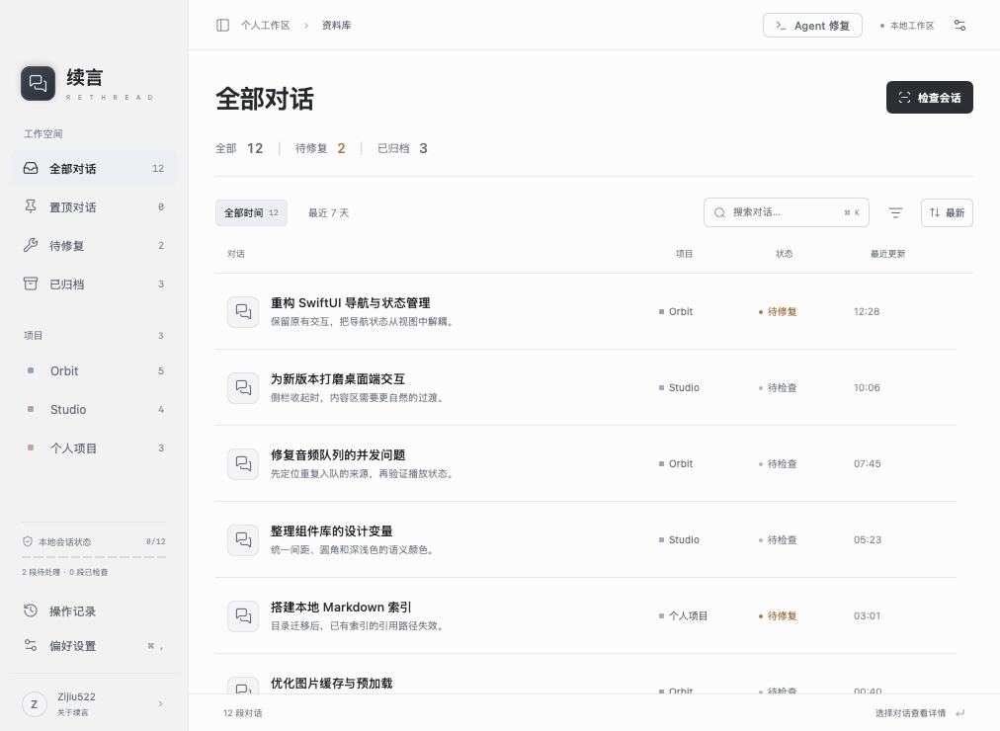

  

<h1 align="center">续言 · ReThread</h1>

macOS 上的 Codex 会话管理工具

  
  
  
  
  

  <a href="#开发背景">开发背景</a> · <a href="#功能">功能</a>

## 开发背景

Codex 用久了，会话会分散在不同项目里，也会留下不少已经结束的讨论。逐条归档、清理旧会话，以及把相关讨论整理到同一个项目，都是反复会用到的操作。历史文件迁移到其他磁盘后，索引与文件位置也需要一起维护。

续言从这些需求开始，做成了一个独立的 macOS 应用：集中处理会话整理、合并、项目归属和索引维护，操作结果同步到本机 Codex。界面使用 SwiftUI / AppKit，本地服务使用 Python，读取 Codex 的 SQLite 索引与会话历史。

  <picture>
    <source media="(prefers-color-scheme: dark)" srcset="docs/assets/library-dark.png">
    
  </picture>

## 功能

### 会话管理

| 功能 | 支持内容 |
| :--- | :--- |
| 浏览与查找 | 按项目、时间、归档状态筛选，搜索会话，查看 Markdown 正文 |
| 日常整理 | 重命名、应用内置顶、归档、取消归档、删除 |
| 批量操作 | 全选筛选结果，批量删除、归档、取消归档；不设固定条数上限 |
| 旧会话 | 按 30 / 90 / 180 / 365 天未更新筛选，区分外置存储与旧版历史 |
| 界面 | 原生 SwiftUI / AppKit，浅色、深色及跟随系统，侧栏分区独立折叠 |

### 合并与项目

- **合并会话** — 调整来源顺序、设置新标题，生成新的 Codex 会话并保留原会话。不设固定来源数量、文件大小或消息条数上限。
- **保留附件** — 合并文字、用户图片与音频内容，保留原有附件引用；工具执行记录和系统上下文不纳入合并。
- **项目归属** — 将独立会话移入已有项目，或选择目录、基于会话新增项目；支持批量移动。
- **项目名称** — 按 Codex 保存的项目名称、归属和顺序显示，独立会话单独归类。
- **整项目删除** — 删除项目登记及其会话，包括已归档和旧会话；保留磁盘上的项目源码目录。

### 诊断与存储

- **会话检查** — 分别显示结构正常、索引可修复、内容异常、外置存储及检查未完成，不把旧记录或未完成检查直接判为损坏。
- **索引修复** — 查找与会话身份匹配的历史文件，修正失效路径。存在多个候选或内容异常时列出问题。
- **索引链接** — 选择已有历史文件，将其关联到对应会话。
- **会话迁移** — 移动历史文件的存储位置并更新索引，保持会话 ID、标题、项目归属和归档状态；默认保留来源副本。
- **Agent 辅助** — 通过 Codex CLI 分析脱敏诊断信息，给出修复建议；执行前查看并确认修改内容。

### 备份与 Codex 同步

- 删除、合并及索引修改前保存相关历史、索引和操作记录，可直接打开备份目录。
- 批量任务显示当前会话、执行阶段与逐项结果，支持完成当前项后停止。
- 删除后同步 Codex 聊天列表；合并后在 Codex 打开新会话并核对同步状态。
- 待同步状态单独显示，可只重试同步，不重复删除或合并。

项目归属调整、整项目删除及存储索引修改需在 Codex 退出后执行，重新打开后生效。备份用于人工恢复，暂未提供一键撤销。

---

  开发者 <a href="https://github.com/Lincb522">Zijiu522</a> · <a href="LICENSE">MIT License</a> · <a href="ThirdPartyNotices">第三方许可</a> 
  独立项目，非 OpenAI 官方应用。

